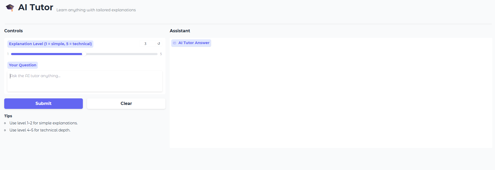

# Gradio + Ollama 3.1 — Dockerized Setup

A minimal, production‑leaning setup to run an AI Tutor UI (Gradio) backed by **Ollama** models. This repo uses Docker Compose to orchestrate two services:

* **`ollama`** – the model runtime (HTTP API on `:11434`)
* **`app`** – the Gradio UI that streams chat via Ollama’s `/api/chat`

The goal is **parity dev→prod**: same containers and env vars locally and on a server.

---

## Architecture & Features

```
[Browser] ⇄ http://localhost:7860  →  [app (Gradio)]  ⇄  http://ollama:11434  →  [ollama]
                                              ▲
                                OLLAMA_BASE_URL=http://ollama:11434
```

* Internal service‑to‑service traffic uses the Docker network hostname `ollama` (not `localhost`).
* Models are stored under `/models` in the `ollama` container. In Windows dev, we mount your local folder; in servers, use a Docker volume.

### What you can do in the UI

* **Choose explanation depth**: the slider selects an *Explanation Level* (1 = very simple, 5 = technical). The app injects a system prompt to tailor the response to that level.
* **Ask any question**: type in the textbox and press **Submit**.
* **Streaming answers**: the assistant streams tokens live while generating.
* **Conversation history**: messages appear in the *Assistant* panel; the session keeps the current conversation while the page is open.
* **Clear chat**: use **Clear** to reset the conversation state.

> Note: by default the history is kept only in the browser session (no database). Restarting the container clears server memory.

---

## Prerequisites

* Docker Desktop (Windows/macOS) or Docker Engine (Linux)
* (Windows only) Close the **Ollama desktop app** so it doesn’t occupy port `11434`.

---

## Repository layout (minimum)

```
.
├─ app/
│  ├─ gradio_ui.py
│  ├─ ai_gradio_streaming_ollama.py
│  ├─ requirements.txt
│  └─ run.sh
├─ infra/
│  └─ docker-compose.yml
├─ .env.example  → copy to .env
└─ README.md
```

---

## Environment variables

Copy `.env.example` to `.env` and adjust if needed.

| Var                 | Service  | Default               | Purpose                                    |
| ------------------- | -------- | --------------------- | ------------------------------------------ |
| `OLLAMA_PORT`       | `ollama` | `11434`               | Host port mapping for the Ollama API       |
| `OLLAMA_HOST`       | `ollama` | `0.0.0.0:11434`       | Bind address inside the container          |
| `OLLAMA_KEEP_ALIVE` | `ollama` | `5m`                  | Keep model in memory for faster latency    |
| `APP_PORT`          | `app`    | `7860`                | Host port mapping for Gradio UI            |
| `OLLAMA_BASE_URL`   | `app`    | `http://ollama:11434` | Base URL that the app uses to reach Ollama |

> The app reads `OLLAMA_BASE_URL` at runtime. In containers, it must be `http://ollama:11434` (service hostname).

---

## Quick start (Windows dev, using your existing local models)

> Make sure drive **C:** is shared with Docker Desktop (Settings → Resources → File sharing).

For this example we are working with **Ollama 3.1**. Follow these steps:

1. **Bring up the stack**

```powershell
cd infra
docker compose up -d
docker compose ps
```

2. **Download the required model (Ollama 3.1)**

```powershell
docker exec -it ollama ollama pull llama3.1
```

3. **Validate the model is listed**

```powershell
docker exec -it ollama ollama list
```

4. **Open the UI in your browser**

Once both services indicate they are running, open:

```
http://localhost:7860/
```

You should see the AI Tutor interface with controls on the left (explanation level slider, input box, submit/clear buttons) and the **Assistant** answer area on the right, similar to this screenshot:



---

## Linux/server variant (use a Docker **volume** for models)

In `infra/docker-compose.yml`, swap the bind mount for a named volume:

```yaml
services:
  ollama:
    volumes:
      - ollama-models:/models
volumes:
  ollama-models:
```

Then:

```bash
cd infra
docker compose up -d ollama
# Pull the model into the volume
docker exec -it ollama ollama pull llama3.1
# Validate model is listed
docker exec -it ollama ollama list
# Start the app
docker compose up -d app
```
---

## Health checks

* `ollama` uses `ollama list` as a health probe.
* `app` checks `http://localhost:7860` internally.
* Compose uses `depends_on: { ollama: { condition: service_healthy } }` so the app starts after Ollama is ready.

---

## Troubleshooting

* **App can’t reach Ollama**: ensure `OLLAMA_BASE_URL=http://ollama:11434` in the **app** service env.
* **Port 11434 already in use**: close the Ollama desktop app or kill the process on that port.
* **Model not found**: run `docker exec -it ollama ollama pull llama3.1`.
* **Bind mount on Windows**: keep quotes around paths with spaces, e.g. `"C:/Users/Your Name/.ollama/models:/models"`.
* **Healthcheck failing for app**: minimal images might not include `wget`. Use a Python or curl-based probe (already configured).

---

## Production hardening (next steps)

* **Reverse proxy (TLS + Auth + CORS)**: front `app` and/or `ollama` with Nginx/Traefik, issue certs, set basic/OIDC auth, rate limits.
* **Observability**: add cAdvisor + Prometheus + Grafana for container CPU/RAM and app latency (Prometheus client in the app with `/metrics`).
* **CI/CD**: build images, run basic tests, and deploy Compose or Helm charts from GitHub Actions.
* **Backups**: snapshot the `ollama-models` volume (or keep a `models.txt` to re‑pull deterministically).

---

## License


Copyright (c) 2025 Rafael Rincon Ramirez

Permission is hereby granted, free of charge, to any person obtaining a copy
